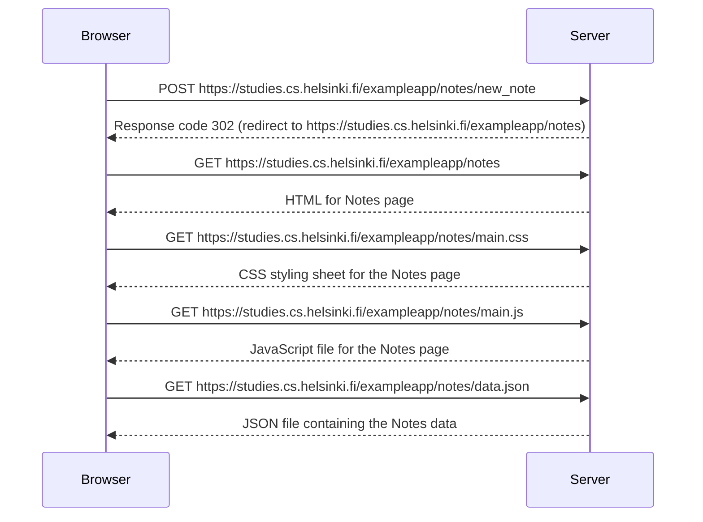

```mermaid
sequenceDiagram
Browser->>Server: POST https://studies.cs.helsinki.fi/exampleapp/notes/new_note
Server-->>Browser: Response code 302 (redirect to https://studies.cs.helsinki.fi/exampleapp/notes)
Browser->>Server: GET https://studies.cs.helsinki.fi/exampleapp/notes
Server-->>Browser: HTML for Notes page
Browser->>Server: GET https://studies.cs.helsinki.fi/exampleapp/notes/main.css
Server-->>Browser: CSS styling sheet for the Notes page
Browser->>Server: GET https://studies.cs.helsinki.fi/exampleapp/notes/main.js
Server-->>Browser: JavaScript file for the Notes page
Browser->>Server: GET https://studies.cs.helsinki.fi/exampleapp/notes/data.json
Server-->>Browser: JSON file containing the Notes data
```